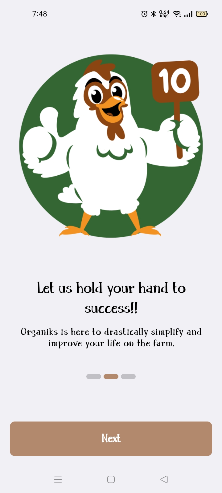
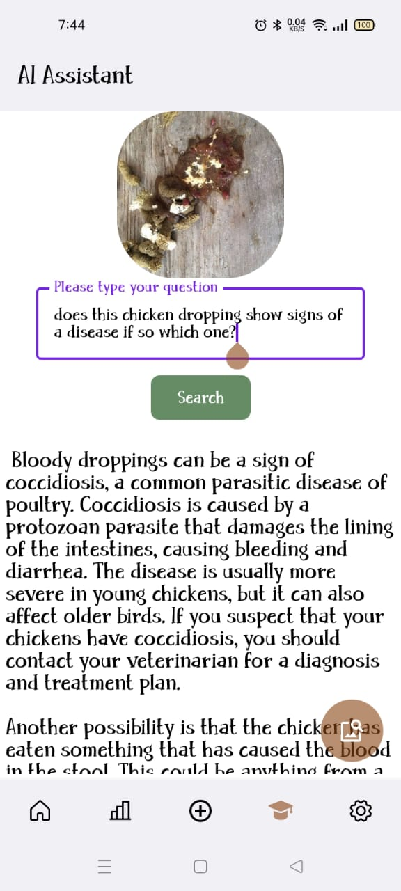
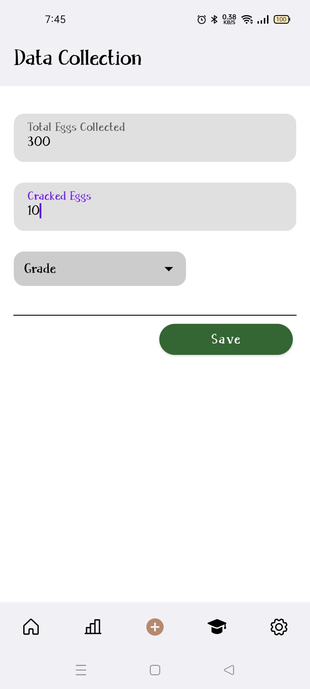
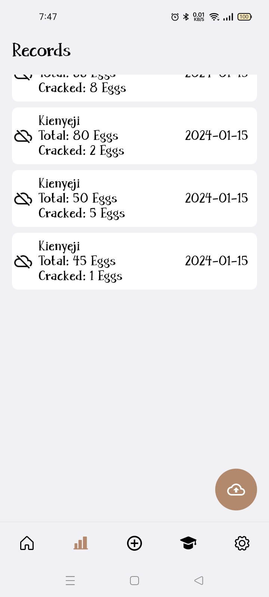

<p align="center"></p>

# Organiks
Organiks Platform combines Android + Firebase(for Auth and Storage) + GEMINI AI(multi-modal), Organiks is aimed at being the Digitizing tool and an Affordable Farmers Assistant for the Agricultural Sector which has been neglected
in terms of Technology here in Africa.

Organiks is a story of two friends from Nakuru, Kenya with a Love for Agriculture, one a MicroBiologist and the other a Techie in love with Coding. Boys who small-scale farming had fed and schooled them.

When we heard of GEMINI AI API late last year(2023), we thought of ideas and ways that this AI could be used to lower the losses that farmers(just like their parents) incur due to loss of their poultry, animals and even plants to diseases.
And that is when project 'Mkulima na Gemini' started brewing in our heads, why? because we could use Gemini LLM on our own without knowledge of AI or ML and bring all the advantages GEMINI has to offer to the 
farmers at almost no extra cost.

The Platform aims at being a Farmers Offline First tool to store their farm records even when offline and when
they have access to Internet Connection they can backup their data(i.e Offline First) to
the Cloud(i.e Firebase) also within the project.

In combination with Offline First Record Keeping, Organiks has implemented the Gemini AI LLM which acts as a farmers assistant, in two ways as a chat assistant and Data Analyst, whether they might have doubts
whether their birds, animals or plants have been attacked by diseases inline with Googles promise of "A world responsibly empowered by AI".

## 🛠️ Prerequisites 🛠️
#### IDE
You can use [Android Studio](https://developer.android.com/studio/) developed by Google.


> For Gemini AI Assistant and Analyst.
#### Gemini Api Key
You can get your key here [Google AI Studio](https://makersuite.google.com/app/prompts/new_freeform) and replace it in envVariables.properties file
in this folder structure(change folder structure to Project from Android) envVariables.properties

You can get Gemini API Docs here [Gemini API Docs](https://ai.google.dev/docs)


> For Firebase.
#### Firebase
You can get your Web client secret here [Firebase Console](https://console.firebase.google.com/) > authentication and replace it in res>values>strings.xml file
- N:B ==> This is required for your authentication with Google in the app.


## Screenshots
### Android
      


## Architecture
 MVVM Architecture.

- Authentication:
  - The apps authentication is done with the support of Firebase.
- Storage:
  - The app is offline-first using ROOM with capabilities to backup the data to cloud i.e Firebase.
- GEMINI Assistant and Analyst:
  - The app also utilizes GEMINI AI API, with multi-modal, markdown and chat support for providing context to the farmers in-case of follow-up questions.


## Built with
- [Android Framework](https://developer.android.com/guide/platform/) - a set of software components that provide the foundation for building Android applications developed by Google.
- [Kotlin Language](https://kotlinlang.org/) - A programming language that makes coding concise, cross-platform, and fun developed by JetBrains
- [Jetpack Compose](https://developer.android.com/compose/) - Android’s recommended modern toolkit for building native UI. It is an open-source Kotlin-based declarative UI framework for Android developed by Google.
- [Gemini AI](https://deepmind.google/technologies/gemini) - a multi-modal large language model(LLM) developed by Google DeepMind.
- [Firebase](https://firebase.google.com/) - An open source framework for building AI-powered apps with familiar code-centric patterns.
- [Ktor Client](https://ktor.io/docs/getting-started-ktor-client.html) -  a multiplatform asynchronous HTTP client, which allows you to make requests and handle responses.
- [ROOM DB](https://developer.android.com/jetpack/androidx/releases/room) - a library that provides an abstraction layer over SQLite to allow for more robust database access while harnessing the full power of SQLite.
- [Dagger Hilt](https://dagger.dev/hilt/) - Kotlin Dependency Injection framework.
- [Kotlinx-datetime](https://github.com/Kotlin/kotlinx-datetime) - KotlinX multiplatform date/time library.
- [Kotlinx-serilization](https://github.com/Kotlin/kotlinx.serialization) - Kotlin multiplatform / multi-format serialization.

## Run project
### Android
To run the application on android device/emulator:
- open project in Android Studio and run imported android run configuration


## License
```xml
Copyright (c) 2024 Aricha Samson

    Permission is hereby granted, free of charge, to any person obtaining a copy
    of this software and associated documentation files (the "Software"), to deal
    in the Software without restriction, including without limitation the rights
    to use, copy, modify, merge, publish, distribute, sublicense, and/or sell
    copies of the Software, and to permit persons to whom the Software is
    furnished to do so, subject to the following conditions:

    The above copyright notice and this permission notice shall be included in all
    copies or substantial portions of the Software.

    THE SOFTWARE IS PROVIDED "AS IS", WITHOUT WARRANTY OF ANY KIND, EXPRESS OR
    IMPLIED, INCLUDING BUT NOT LIMITED TO THE WARRANTIES OF MERCHANTABILITY,
    FITNESS FOR A PARTICULAR PURPOSE AND NONINFRINGEMENT. IN NO EVENT SHALL THE
    AUTHORS OR COPYRIGHT HOLDERS BE LIABLE FOR ANY CLAIM, DAMAGES OR OTHER
    LIABILITY, WHETHER IN AN ACTION OF CONTRACT, TORT OR OTHERWISE, ARISING FROM,
    OUT OF OR IN CONNECTION WITH THE SOFTWARE OR THE USE OR OTHER DEALINGS IN THE
    SOFTWARE.
```  

  
